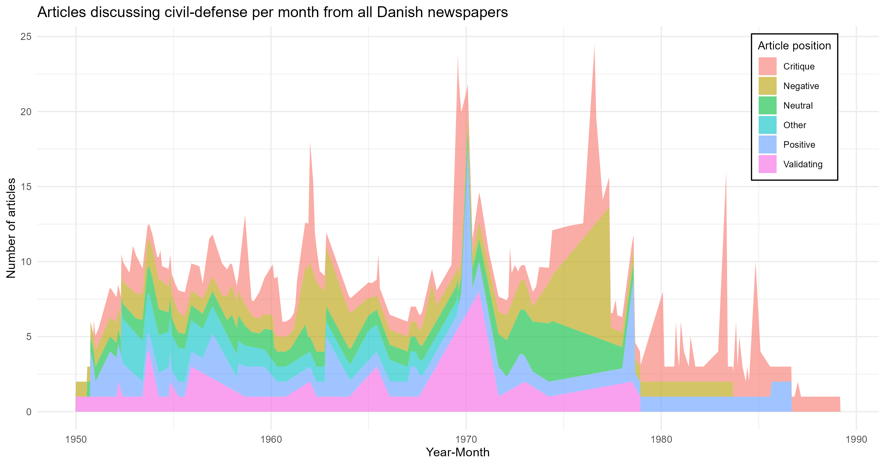

# Public Discourse on Civil Defense 
*ANALYSIS*

This repository analyzes a sample of ca 100 articles per decade spanning from 1949-1989, written on the topic of civil-defense in Aarhus, stored in Mediestream, the Danish public repository of digitized newspapers. It presents an analysis of the main themes the were broached by the media and controversies that surrounded the build-up of civil-defense in Denmark since the Second World War, that formed the basis for a paper in the *Journal of Cold War Studies*. In this repository we visualize several timeseries pointing to the differentiation of opinion over time and across different newspaper venues, and illustrate the changing emotional loading and polarity of the public discourse on the basis of  ChatGPT-generated classifications of the articles' English summaries.

---

## Purpose
Analysis of public discourse on the basis of Mediastream articles

---
## Authors
* Adela Sobotkova ]), MELICA project, adela@cas.au.dk

## License
CC-BY-SA 4.0, see attached License.md

## DOI
[Here will be DOI or some other identifier of the resulting article once we have it]

### References
[Here will go related articles or other sources we will publish/create]

---
# How to use this repository

## Sources and prerequisites
Visualisations depend on articles_ts.rds tsibble, a spatial type of tibble (native R format for a table or a dataframe) that facilitates temporal visualisation. This dataset is created from a [googlesheet](https://docs.google.com/document/d/1wlaoUXUlRF98wJx0uPl05pk4NlGBJtUAfEJgGIU47BU/edit?tab=t.0#heading=h.643govzc31g8 ) containing metadata, full-text and English summary of over 500 newspaper articles, manually extracted from Mediestream responses to keywords such as 'civilforsvar', 'mening', 'debat', manually compiled by Stine Lykke Thomassen during 2024-2025. 

### Data
The full collection of articles that form basis of the articles_ts.rds is archived in [public_discourse folder on the project's GoogleDrive](https://drive.google.com/drive/folders/1aCysLseoVLjz1OBiVglzLTYXRJUt1PWX)

### Software
1. R 4.3.3

### Hardware
1. Multiple-screens
2. Mouse
3. Coffee

## Screenshots

